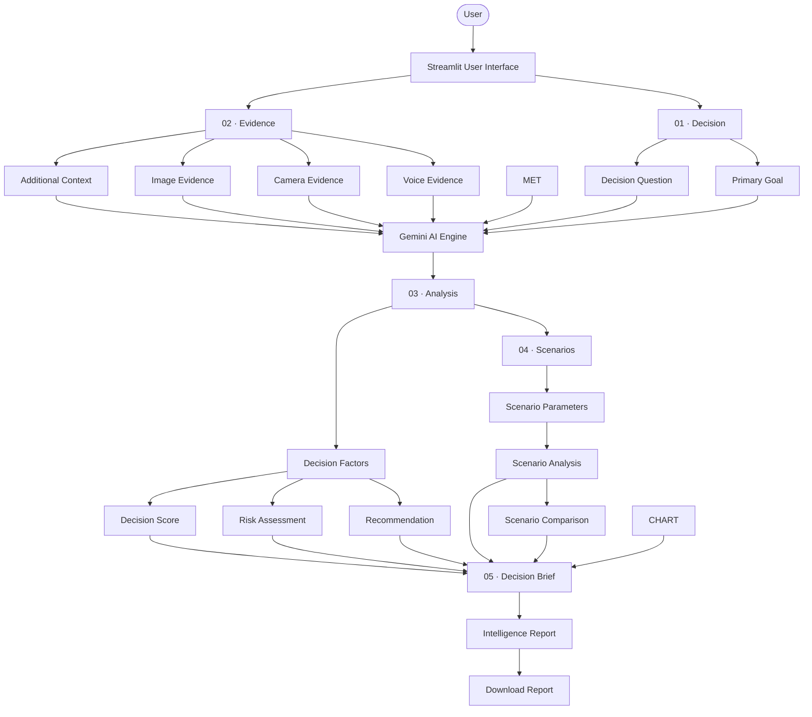
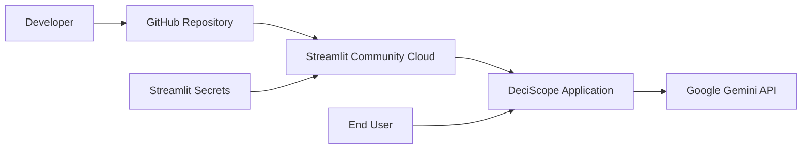

# 🏗️ DeciScope — System Architecture & Technical Design

DeciScope is a multimodal AI-powered decision intelligence application built with Streamlit, Plotly, and Google Gemini.

The system collects a user's decision, supporting evidence, workload data, visual evidence, and contextual information, then uses structured analysis to generate decision insights, risk assessment, recommendations, scenarios, and a downloadable intelligence report.

---

# 1. System Architecture



---

# 2. Application Workflow

DeciScope follows a five-stage decision workflow:

```text
01 · Decision
      ↓
02 · Evidence
      ↓
03 · Analysis
      ↓
04 · Scenarios
      ↓
05 · Decision Brief
```

### Stage 01 — Decision

The user defines:

- Decision question
- Primary decision goal

The information is stored using Streamlit session state and becomes the foundation for the remaining analysis.

### Stage 02 — Evidence

The user can provide supporting evidence through:

- Additional text context
- Image upload
- Camera input
- Voice input

### Stage 03 — Analysis

The collected decision context and evidence are processed and passed to the AI analysis pipeline.

The application generates decision factors, scoring, risk assessment, and recommendations.

### Stage 04 — Scenarios

Users can explore alternative conditions and compare how changing assumptions can affect the decision.

### Stage 05 — Decision Brief

The final information is presented as an intelligence report that summarizes the decision, analysis, scenarios, risks, and recommendation.

---

# 3. Data Flow

The overall data flow is:

```text
User Input
    ↓
Decision Context
    ↓
Evidence Collection
    ↓
Streamlit Session State
    ↓
Data Processing
    ↓
Gemini Analysis
    ↓
Decision Factors
    ↓
Score + Risk + Recommendation
    ↓
Scenario Analysis
    ↓
Decision Brief
    ↓
Intelligence Report
```

---

# 4. Evidence Processing

## Text Evidence

```text
User Context
     ↓
Streamlit Input
     ↓
Session State
     ↓
Gemini Analysis Context
```

Additional context allows the user to explain circumstances that may not be represented by structured data.

---

---

## Image Evidence

```text
Image Upload
     ↓
Streamlit Image Input
     ↓
Gemini Vision Analysis
     ↓
Visual Context
     ↓
Decision Analysis
```

Images can provide additional context such as schedules, documents, posters, screenshots, or other visual evidence relevant to the decision.

---

## Camera Evidence

```text
Camera Input
     ↓
Captured Image
     ↓
Gemini Vision
     ↓
Visual Context
     ↓
Decision Analysis
```

The camera input allows users to provide real-world visual evidence directly from the application.

---

## Voice Evidence

```text
Voice Recording
     ↓
Audio Input
     ↓
AI Processing
     ↓
Context Extraction
     ↓
Decision Analysis
```

Voice evidence provides a natural way for users to describe their situation.

---

# 5. Gemini AI Integration

Gemini is used as the application's decision-analysis engine.

The integration is separated from the main application logic through:

```text
app.py
   ↓
gemini_service.py
   ↓
Google Gemini API
   ↓
AI Response
   ↓
Streamlit Application
```

The application does not treat Gemini as a generic chatbot.

Instead, the AI receives decision-specific context such as:

- Decision question
- Primary goal
- User context
- Activity information
- Workload metrics
- Visual evidence
- Voice context
- Scenario information

This allows the generated analysis to remain focused on the user's specific decision.

---

# 6. Prompt Engineering

Prompt definitions are maintained separately in:

```text
prompts.py
```

The prompts are designed to provide Gemini with structured decision context.

The general process is:

```text
Decision Data
     +
User Context
     +
Evidence
     +
Activity Metrics
     +
Scenario Information
          ↓
Dynamic Prompt
          ↓
Gemini
          ↓
Structured Analysis
```

This separation makes the AI instructions easier to maintain and modify without changing the main Streamlit interface.

---

# 7. Application Modules

## `app.py`

The main application module.

Responsibilities include:

- Streamlit interface
- Sidebar navigation
- Page workflow
- Session state
- Decision creation
- Evidence collection
- Data visualization
- Scenario interaction
- Decision brief
- Report interface

---

## `gemini_service.py`

Handles Gemini-related functionality.

Responsibilities include:

- Gemini API communication
- AI analysis requests
- Multimodal processing
- AI response handling
- Error handling for API requests

---

## `prompts.py`

Contains structured prompts used by the Gemini analysis pipeline.

Responsibilities include:

- System instructions
- Decision-analysis prompts
- Dynamic context construction
- Scenario-analysis prompts

---

## `utils.py`

Contains reusable application utilities.

Responsibilities may include:

- Data processing
- Activity metrics
- Decision calculations
- Risk calculations
- Recommendation helpers
- Other reusable functions

---

# 8. Session State Management

Streamlit applications rerun when users interact with widgets.

DeciScope uses `st.session_state` to preserve important information throughout the multi-step workflow.

Important state variables include information related to:

```text
Decision
Evidence
Analysis
Scenarios
Decision Brief
```

Examples include:

```text
decision_question
decision_goal
uploaded_image
camera_image
voice_context
analysis_complete
scenario_used
brief_viewed
```

This prevents previously collected information from being lost during Streamlit reruns.

---

# 10. Decision Analysis

The analysis stage combines the collected evidence and decision context.

The general process is:

```text
Decision
   +
Evidence
   +
Activity Insights
   +
User Context
        ↓
AI Analysis
        ↓
Decision Factors
        ↓
Decision Score
        ↓
Risk Assessment
        ↓
Recommendation
```

The analysis is designed to help users understand the trade-offs associated with a decision rather than simply provide a generic AI response.

---

# 11. Scenario Analysis

DeciScope allows users to explore alternative decision conditions.

```text
Original Decision
       ↓
Scenario Parameters
       ↓
Scenario Analysis
       ↓
Alternative Outcome
       ↓
Comparison
```

This allows users to examine how changing relevant assumptions can affect the decision.

---

# 12. Intelligence Report

The final stage combines the major outputs of the decision workflow.

```text
Decision
   +
Evidence
   +
Analysis
   +
Risk
   +
Recommendation
   +
Scenarios
       ↓
Intelligence Report
```

The report provides a consolidated view of the decision and its supporting analysis.

Where implemented, the report can also be downloaded by the user.

---

# 13. Error Handling

The application provides user-facing feedback for common situations including:

- Empty decision input
- Missing evidence
- Missing configuration
- Gemini API failures
- Invalid or incomplete responses

Streamlit feedback components are used where appropriate:

```python
st.info()
st.warning()
st.error()
st.success()
```

This helps users understand application states without exposing unnecessary technical details.

---

# 14. API Security

The Gemini API key is not hard-coded into the application.

For deployment, the API credential is stored using:

```text
Streamlit Community Cloud Secrets
```

Example configuration:

```toml
GEMINI_API_KEY = "your_api_key_here"
```

The actual API key must never be committed to the GitHub repository.

---

# 15. Deployment Architecture

DeciScope is deployed using Streamlit Community Cloud.



### Deployment Flow

```text
GitHub Repository
       ↓
Streamlit Community Cloud
       ↓
requirements.txt
       ↓
Application Deployment
       ↓
Streamlit Secrets
       ↓
Gemini API
```

Live application:

https://deciscope.streamlit.app/

---

# 16. Technology Stack

| Technology | Purpose |
|---|---|
| Python | Application logic |
| Streamlit | Web application and UI |
| Google Gemini | AI decision analysis |
| Gemini Vision | Visual evidence analysis |
| Gemini Audio | Voice evidence processing |
| Plotly | Interactive visualization |
| Pillow | Image processing |
| Git | Version control |
| GitHub | Source code and documentation |
| Streamlit Community Cloud | Cloud deployment |

---

# 17. Project Structure

```text
DECISCOPE/
│
├── app.py
├── gemini_service.py
├── prompts.py
├── utils.py
├── requirements.txt
├── README.md
│
├── docs/
│   └── architecture.md
│
└── assets/
    └── deciscope_logo.png
```

---

# 18. Design Principles

DeciScope follows these core principles:

### Evidence-driven

The application encourages users to support decisions with multiple forms of evidence.

### Multimodal

Text, structured data, images, camera input, and voice can contribute to the decision context.

### Explainable

The application presents decision factors, risks, scenarios, and recommendations rather than only returning a single AI answer.

### Interactive

Users can edit data, explore visualizations, and test alternative scenarios.

### User-controlled

DeciScope is designed to assist the user's decision-making rather than blindly make decisions on the user's behalf.

---

# 19. End-to-End System

The complete DeciScope architecture can be summarized as:

```text
                    ┌─────────────────┐
                    │      USER       │
                    └────────┬────────┘
                             │
                             ▼
                  ┌─────────────────────┐
                  │  STREAMLIT UI       │
                  └──────────┬──────────┘
                             │
              ┌──────────────┴──────────────┐
              │                             │
              ▼                             ▼
       ┌─────────────┐              ┌────────────────┐
       │  DECISION   │              │    EVIDENCE    │
       └──────┬──────┘              └───────┬────────┘
              │                             │
              │              ┌──────────────┼──────────────┐
              │              │              │              │
              │              ▼              ▼              ▼
              │             IMAGE          VOICE
              │                             │              │
              │              ▼              ▼              ▼
              │                         GEMINI         GEMINI
              │              │           VISION          AUDIO
              │              │              │              │
              └──────────────┴──────────────┴──────────────┘
                             │
                             ▼
                    ┌─────────────────┐
                    │   GEMINI AI     │
                    │     ENGINE      │
                    └────────┬────────┘
                             │
                             ▼
                    ┌─────────────────┐
                    │    ANALYSIS     │
                    └────────┬────────┘
                             │
                ┌────────────┼────────────┐
                ▼            ▼            ▼
             SCORE         RISK      RECOMMENDATION
                │            │            │
                └────────────┼────────────┘
                             │
                             ▼
                    ┌─────────────────┐
                    │    SCENARIOS     │
                    └────────┬────────┘
                             │
                             ▼
                    ┌─────────────────┐
                    │ DECISION BRIEF  │
                    └────────┬────────┘
                             │
                             ▼
                    ┌─────────────────┐
                    │   INTELLIGENCE  │
                    │     REPORT      │
                    └─────────────────┘
```

---

# 20. Conclusion

DeciScope combines Streamlit's interactive application capabilities, Plotly visualization, and Google's Gemini multimodal AI to create an evidence-driven decision intelligence workflow.

The architecture separates the user interface, AI services, prompts, and utility logic while using Streamlit session state to maintain information across the multi-stage workflow.

The result is a structured pipeline:

```text
Define → Collect → Analyze → Simulate → Review
```

designed to help users make more informed decisions using their own context and evidence.