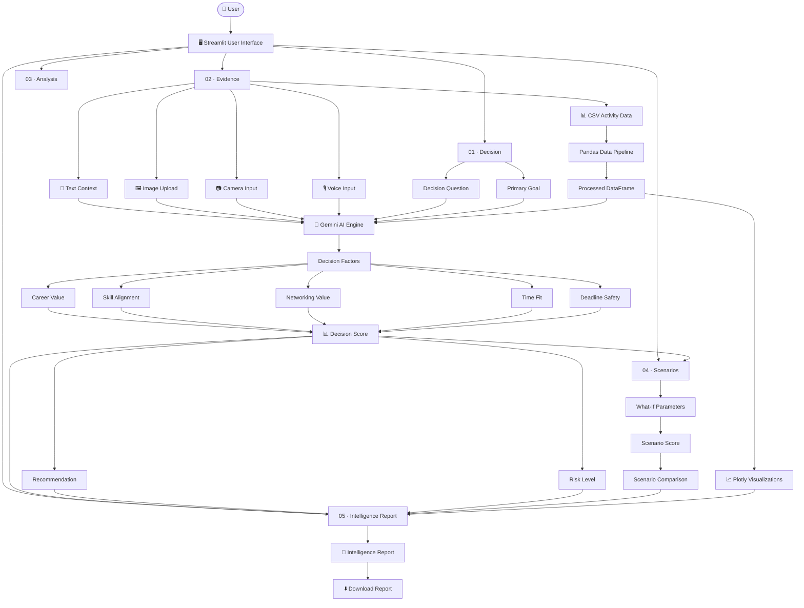

# 🏗️ DeciScope — System Architecture

## Overview

DeciScope follows a modular architecture where the user moves through a structured decision workflow:

**Decision → Evidence → Analysis → Scenarios → Intelligence Report**

The application combines Streamlit UI components, Pandas-based data processing, and Gemini multimodal AI to transform different types of evidence into structured decision insights.

---

## System Architecture Diagram



---

# 🔄 Application Data Flow

## 1. Decision Input

The user first defines the decision they want to evaluate.

```text
User
 ↓
Decision Question
 ↓
Primary Goal
 ↓
Decision Context
```

The information is stored using Streamlit's `st.session_state` so it remains available throughout the workflow.

---

## 2. Evidence Collection

DeciScope supports multiple evidence sources:

```text
                    ┌── Text Context
                    │
                    ├── CSV Activity Data
                    │
Decision ──→ Evidence ── Image Upload
                    │
                    ├── Camera Input
                    │
                    └── Voice Input
```

This allows the decision analysis to use both structured and unstructured evidence.

---

# 📊 3. Data Processing Pipeline

CSV activity data is processed using Pandas.

```text
CSV Upload
    ↓
Pandas DataFrame
    ↓
Data Validation
    ↓
Interactive st.data_editor
    ↓
Metric Calculation
    ↓
Workload Insights
    ↓
Plotly Visualizations
```

The application generates visual insights such as:

- Hours by Category
- Workload by Priority
- Daily Time Allocation
- Development Time Percentage
- High-Priority Activity Insights

---

# 🤖 4. Gemini AI Pipeline

The collected evidence is combined with the decision context and passed to the Gemini AI engine.

```text
Decision Context
       +
User Context
       +
CSV Insights
       +
Image Evidence
       +
Camera Evidence
       +
Voice Context
       ↓
┌──────────────────────┐
│    Gemini AI Engine  │
└──────────┬───────────┘
           ↓
   Structured Analysis
```

Gemini is used as a **decision analysis engine**, rather than as a generic chatbot.

The analysis considers the user's specific decision, goals, workload, and available evidence.

---

# 🧮 5. Decision Analysis

The AI analysis produces structured decision factors:

```text
Career Value
Skill Alignment
Networking Value
Time Fit
Deadline Safety
```

These factors contribute to the overall decision score.

```text
Decision Factors
       ↓
Decision Score
       ↓
┌────────────────────────────┐
│ Recommendation             │
│ Risk Level                 │
│ Decision Insights          │
│ Key Considerations         │
└────────────────────────────┘
```

---

# 🔄 6. Scenario Simulation

The scenario engine allows the user to modify decision factors and observe how the outcome changes.

```text
Original Decision
       ↓
Original Score
       ↓
What-If Parameters
       ↓
Scenario Score
       ↓
Comparison
       ↓
Decision Change
```

Example:

```text
Original Score → 72

Change:
Time Fit ↓
Career Value ↑

        ↓

Scenario Score → 78
```

This helps users understand **which conditions could change the decision**.

---

# 📑 7. Intelligence Report

The final report combines the major outputs of the system.

```text
                    ┌── Decision
                    │
                    ├── Evidence
                    │
                    ├── Decision Score
                    │
                    ├── Recommendation
                    │
                    ├── Risk Level
                    │
                    ├── Scenario Results
                    │
                    └── Key Insights
                           ↓
                 ┌───────────────────┐
                 │ Intelligence      │
                 │ Report             │
                 └─────────┬─────────┘
                           ↓
                    Download Report
```

The report provides a consolidated view of the decision so the user can review the reasoning and scenario outcomes.

---

# 🧩 Application Modules

| Module | Responsibility |
|---|---|
| `app.py` | Main Streamlit application and workflow |
| `gemini_service.py` | Gemini API communication and AI analysis |
| `prompts.py` | Structured AI prompts |
| `utils.py` | Data processing, scoring and helper functions |
| `requirements.txt` | Python dependencies |
| `.streamlit/secrets.toml` | Secure API configuration |

---

# 🗃️ State Management

DeciScope uses Streamlit `st.session_state` to maintain information between interactions and workflow stages.

Important state categories include:

```text
Decision State
    ↓
Decision Question
Decision Goal
Analysis Status

Evidence State
    ↓
Uploaded Data
Visual Evidence
Voice Context
User Context

Analysis State
    ↓
Decision Score
Recommendation
Risk Level
Decision Factors

Scenario State
    ↓
Scenario Values
Scenario Score
Scenario Comparison

Report State
    ↓
Brief Viewed
Report Data
```

This prevents important information from being lost when Streamlit reruns the application.

---

# 🔐 API Integration Strategy

Gemini API access is isolated from the main UI logic through:

```text
app.py
   ↓
gemini_service.py
   ↓
Gemini API
```

The API key is stored securely through Streamlit Secrets rather than being hard-coded.

```text
Streamlit Secrets
       ↓
GEMINI_API_KEY
       ↓
Gemini Service
       ↓
Gemini API
```

---

# ☁️ Deployment Architecture

DeciScope is deployed through Streamlit Community Cloud.

```text
GitHub Repository
       ↓
Streamlit Community Cloud
       ↓
requirements.txt
       ↓
Streamlit Application
       ↓
Secure Streamlit Secrets
       ↓
Gemini API
```

### Live Application

**[DeciScope](https://deciscope.streamlit.app/)**

---

# 🎯 Architectural Design Principles

DeciScope follows these design principles:

### 1. Modular Design

AI services, prompts, utilities, and UI logic are separated into different modules.

### 2. Stateful Workflow

`st.session_state` maintains information throughout the five-stage decision workflow.

### 3. Multimodal Evidence

The system can combine text, structured data, images, camera input, and voice context.

### 4. Evidence-Based Analysis

The AI analysis is based on the decision context and evidence collected from the user.

### 5. Interactive Visualization

Pandas and Plotly convert structured activity data into understandable visual insights.

### 6. Scenario-Based Reasoning

Users can test how changes in decision factors could affect the final outcome.

### 7. Secure API Handling

Sensitive Gemini credentials are stored using Streamlit Secrets.

---

# 🔁 Complete System Flow

```text
                         USER
                           │
                           ▼
                  ┌─────────────────┐
                  │ 01 · DECISION   │
                  └────────┬────────┘
                           │
                           ▼
                  ┌─────────────────┐
                  │ 02 · EVIDENCE   │
                  └────────┬────────┘
                           │
             ┌─────────────┼─────────────┐
             ▼             ▼             ▼
          Pandas        Gemini        Visual/Audio
          Data          Inputs          Evidence
             │             │             │
             └─────────────┼─────────────┘
                           ▼
                  ┌─────────────────┐
                  │ 03 · ANALYSIS   │
                  └────────┬────────┘
                           │
                           ▼
                 Decision Factors
                           │
                           ▼
                  Score + Risk +
                  Recommendation
                           │
                           ▼
                  ┌─────────────────┐
                  │ 04 · SCENARIOS  │
                  └────────┬────────┘
                           │
                           ▼
                    What-If Analysis
                           │
                           ▼
                  Scenario Comparison
                           │
                           ▼
                  ┌─────────────────┐
                  │ 05 · INTELLIGENCE│
                  │      REPORT     │
                  └────────┬────────┘
                           │
                           ▼
                    Download Report
```

---

## 🧠 Architecture Summary

DeciScope combines **Streamlit, Pandas, Plotly and Gemini multimodal AI** into a structured decision-support pipeline.

The architecture transforms:

**User Decision → Multimodal Evidence → Data Processing → AI Analysis → Scenario Simulation → Intelligence Report**

This design allows DeciScope to provide structured, evidence-aware decision support while keeping the user in control of the final decision.