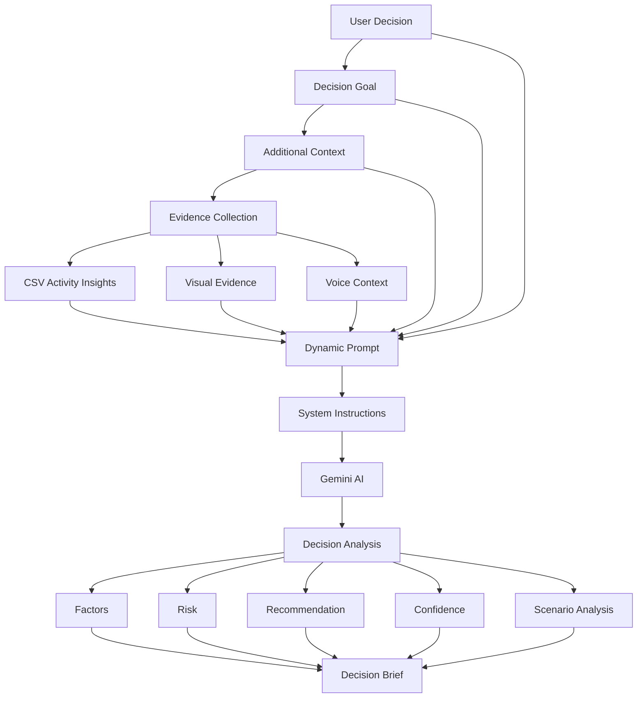

# 🧠 DeciScope — Prompt Strategy

## Overview

DeciScope uses Google Gemini as a decision-analysis engine rather than as a general-purpose chatbot.

The prompt strategy is designed to provide Gemini with structured, decision-specific context collected from the user's decision, goals, evidence, workload data, multimodal inputs, and scenario parameters.

The overall approach is:

```text
User Decision
     ↓
User Goal
     ↓
Additional Context
     ↓
Evidence
     ↓
Activity Insights
     ↓
Multimodal Context
     ↓
Dynamic Prompt
     ↓
Gemini
     ↓
Decision Analysis
```

---

# 1. Prompt Design Philosophy

DeciScope follows four main principles when constructing prompts.

### 1. Decision-specific

Gemini receives the actual decision being evaluated instead of a generic question.

Example:

```text
Decision:
Should I attend this hackathon?

Goal:
Career Growth
```

This allows the analysis to remain focused on the user's specific situation.

---

### 2. Context-aware

The prompt incorporates additional information provided by the user.

Examples include:

- Personal context
- Deadlines
- Current workload
- Priorities
- Available time
- Existing commitments
- Supporting evidence

This gives Gemini more information before generating an analysis.

---

### 3. Evidence-driven

Where available, structured and multimodal evidence is incorporated into the analysis.

```text
Decision
   +
Text Context
   +
CSV Insights
   +
Image Evidence
   +
Voice Context
        ↓
Gemini
```

This reduces reliance on the decision question alone.

---

### 4. Structured reasoning

The prompts guide Gemini toward useful decision outputs such as:

- Decision factors
- Advantages
- Risks
- Trade-offs
- Recommendation
- Confidence
- Scenario implications

The objective is to produce useful decision intelligence rather than a generic conversational response.

---

# 2. Dynamic Context Construction

DeciScope dynamically builds the AI context from the information collected during the workflow.

The conceptual prompt structure is:

```text
SYSTEM INSTRUCTIONS

↓

DECISION CONTEXT

↓

USER GOAL

↓

ADDITIONAL CONTEXT

↓

ACTIVITY INSIGHTS

↓

MULTIMODAL EVIDENCE

↓

ANALYSIS REQUIREMENTS

↓

EXPECTED OUTPUT
```

This allows the same analysis pipeline to work with different decisions and different evidence.

---

# 3. System Prompt Strategy

The system-level instructions establish Gemini's role within DeciScope.

The AI is positioned as a:

```text
Decision Intelligence Analyst
```

rather than a generic assistant.

The system instructions define the expected behavior of the AI and establish that the analysis should:

- Focus on the user's decision
- Consider the available evidence
- Identify important trade-offs
- Highlight risks
- Avoid unsupported assumptions
- Provide a practical recommendation
- Explain the reasoning behind the recommendation

---

# 4. Decision Context

The decision prompt includes the user's primary decision.

Example:

```text
Decision:
Should I participate in this hackathon?

Primary Goal:
Career Growth
```

The decision context provides the central problem that Gemini must analyze.

---

# 5. User Context

Additional context is included when provided by the user.

Example:

```text
Additional Context:

I have an assignment due Monday and want to improve
my AI skills while managing my current workload.
```

This allows Gemini to consider circumstances that may not be visible from structured activity data.

---

# 6. Activity Data Context

When a CSV file is uploaded, DeciScope processes the dataset using Pandas before using the resulting information in the analysis.

The process is:

```text
CSV
 ↓
Pandas DataFrame
 ↓
Metrics
 ↓
Activity Insights
 ↓
Gemini Context
```

Relevant information can include:

- Total tracked hours
- Development hours
- Development percentage
- High-priority activity
- Category distribution
- Daily workload

Instead of unnecessarily passing raw data, the application can provide useful derived insights to the AI analysis.

---

# 7. Visual Evidence Prompt Strategy

Visual evidence can be supplied through:

- Image upload
- Camera input

The image becomes an additional source of decision context.

Conceptually:

```text
Image
 ↓
Gemini Vision
 ↓
Visual Observations
 ↓
Decision Context
 ↓
Analysis
```

The visual evidence is considered alongside the user's textual and structured information.

Examples of useful visual evidence include:

- Schedules
- Screenshots
- Posters
- Documents
- Photos
- Other decision-related visual information

---

# 8. Voice Evidence Strategy

Voice input provides another way for the user to explain their situation naturally.

The conceptual workflow is:

```text
Voice Recording
 ↓
Audio Processing
 ↓
Context Extraction
 ↓
Decision Context
 ↓
Gemini Analysis
```

Voice evidence is intended to capture information that users may find easier to explain verbally than through a text field.

---

# 9. Analysis Prompt

The main analysis prompt combines the available context.

Conceptually:

```text
Analyze the following decision.

Decision:
{decision_question}

Primary Goal:
{decision_goal}

Additional Context:
{user_context}

Activity Insights:
{activity_insights}

Visual Evidence:
{visual_context}

Voice Context:
{voice_context}
```

The available fields are dynamically populated according to the evidence provided by the user.

---

# 10. Analysis Requirements

The analysis prompt directs Gemini to examine the decision from multiple perspectives.

The analysis focuses on:

### Benefits

What positive outcomes could result from the decision?

### Risks

What could go wrong?

### Trade-offs

What does the user gain and what might they sacrifice?

### Constraints

How do time, workload, deadlines, or other evidence affect the decision?

### Recommendation

What option appears most reasonable based on the available evidence?

### Confidence

How reliable is the recommendation given the available information?

---

# 11. Scenario Prompt Strategy

DeciScope also supports what-if analysis.

Instead of analyzing only the original decision, users can change relevant conditions and examine alternative outcomes.

The conceptual flow is:

```text
Original Analysis
       ↓
Scenario Parameters
       ↓
Modified Context
       ↓
Gemini / Decision Logic
       ↓
Scenario Outcome
       ↓
Comparison
```

Example:

```text
Original:
Current workload = High

Scenario:
Current workload = Moderate
```

The system can then evaluate how the changed condition affects the decision.

---

# 12. Prompt Separation

Prompt definitions are maintained separately in:

```text
prompts.py
```

This keeps AI instructions separate from the Streamlit interface.

The architecture is:

```text
app.py
   │
   ├── Collect user information
   │
   ├── Prepare context
   │
   └── Call analysis
            ↓
       prompts.py
            ↓
       Dynamic Prompt
            ↓
   gemini_service.py
            ↓
       Gemini API
```

This separation improves maintainability and makes prompt modifications easier.

---

# 13. Dynamic Prompt Construction

DeciScope uses dynamic values inside prompts so that Gemini receives information specific to the current session.

Conceptually:

```python
prompt = f"""
Decision: {decision_question}

Goal: {decision_goal}

Context: {user_context}

Activity Insights: {activity_insights}
"""
```

This means the same prompt structure can be reused across different decisions while the actual context changes dynamically.

---

# 14. Evidence-Aware Analysis

The prompt strategy is designed to adapt to the evidence available.

### No evidence

```text
Decision
   ↓
Context
   ↓
Gemini
```

### CSV evidence

```text
Decision
   +
Context
   +
Activity Insights
   ↓
Gemini
```

### Visual evidence

```text
Decision
   +
Context
   +
Image
   ↓
Gemini
```

### Multiple evidence sources

```text
Decision
   +
Context
   +
CSV
   +
Image
   +
Voice
   ↓
Gemini
```

This allows DeciScope to progressively improve the analysis as more evidence becomes available.

---

# 15. Prompt Safety and Reliability

The prompt strategy encourages Gemini to avoid treating missing information as known facts.

The analysis should distinguish between:

```text
Provided Evidence
```

and

```text
Inference / Interpretation
```

When evidence is incomplete, the analysis should acknowledge uncertainty rather than presenting assumptions as facts.

---

# 16. Error Handling

Gemini API requests can fail because of temporary service issues, invalid configuration, quota limitations, or other API conditions.

DeciScope handles these situations at the application level and provides user-facing feedback rather than silently failing.

The general flow is:

```text
Gemini Request
      ↓
Success?
   /       \
 YES       NO
  ↓         ↓
Analysis   Error Handling
            ↓
       User Feedback
```

---

# 17. Prompt Evolution

The prompt strategy can be extended without redesigning the application architecture.

Potential future improvements include:

- More specialized decision-analysis prompts
- Domain-specific reasoning
- Improved scenario prompts
- Structured JSON responses
- Confidence calibration
- Evidence weighting
- Decision history-aware prompts
- Personalized analysis
- More advanced multimodal reasoning

---

# 18. Example End-to-End Prompt Flow

A simplified example:

```text
SYSTEM
Act as a decision intelligence analyst.

        ↓

DECISION
Should I attend this hackathon?

        ↓

GOAL
Career Growth

        ↓

USER CONTEXT
I have an assignment due Monday and want
to improve my AI skills.

        ↓

ACTIVITY INSIGHTS
Tracked workload is high.
Several activities are high priority.

        ↓

VISUAL EVIDENCE
Schedule screenshot indicates limited
availability during the weekend.

        ↓

ANALYSIS INSTRUCTIONS
Evaluate benefits, risks, trade-offs,
constraints and recommendation.

        ↓

GEMINI

        ↓

OUTPUT
Decision Factors
Risk
Score
Recommendation
Reasoning
Confidence
```

---

# 19. Overall Prompt Architecture



---

# 20. Summary

DeciScope's prompt strategy transforms Gemini from a general conversational model into a context-aware decision analysis engine.

The strategy combines:

```text
Structured Decision
        +
User Context
        +
Activity Data
        +
Visual Evidence
        +
Voice Evidence
        ↓
Dynamic Prompt
        ↓
Gemini
        ↓
Decision Intelligence
```

The central principle is:

> **Better context and better evidence lead to more useful decision analysis.**

DeciScope therefore focuses on collecting and structuring relevant information before asking the AI to analyze the decision.